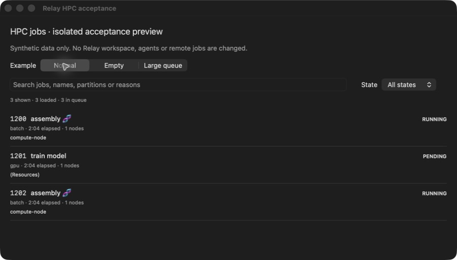

# Relay HPC jobs

Inspect your Slurm jobs from the pane connected to the cluster.

*Actual native Relay component captured September 19, 2026 in an isolated test window. Synthetic data only. Development preview—not a promise that these features are in the released app.*

## Status

The published **v0.1.0** is an experimental read-only prerelease. Use that exact tag for the published feature set.

Features and screenshots here describe the current Relay development implementation. A compatible app and matching helper are required; installed-app and release acceptance remain incomplete.

This is a **data-only package**. Its manifest selects operations implemented in [Relay](https://github.com/genomewalker/relay-terminal). It does not download executable plugin code, run install hooks or add background polling.

## Features

- Owned-job listing with ID, name, state, partition, elapsed time, node count and pending reason.
- Local text/state filters; anchored controls while the job list scrolls.
- Queue totals and explicit partial results when only 500 rows are loaded.

## Install

Use the experimental `v0.1.0` release.

1. Use a compatible Relay app and matching `relayd` on the target host.
2. Open **Settings → Plugins**, enter `genomewalker/relay-plugin-hpc-jobs` and the exact released tag.
3. Review the repository, digest and permissions. Install, then explicitly Enable.
4. Select the intended terminal pane and click the puzzle-piece toolbar button.

Updates require another review and start disabled. Disable, Roll back and Uninstall are available in Settings. Safe mode suppresses plugin tools. Existing release assets must not be overwritten.

## Use

Select HPC jobs, confirm the host and refresh. Filter by text or state; filters only search the loaded rows.

The panel captures its originating pane and connection; changing tabs does not retarget a request. File tools need a known working directory. Reopen the panel from the intended directory when necessary. Each read is explicit; active terminal workers and agents are not restarted.

## Permissions and safety

`remoteOperation`: fixed scheduler queries on the captured connection, not arbitrary package-supplied commands.

Relay checks the enabled package and digest before running and before showing results. An incompatible helper produces an error, not a misleading empty result.

## Limits and remaining work

The published v0.1.0 is read-only. Job details, bounded log tails and separately authorized submit/cancel operations exist in the development implementation but are NOT included in v0.1.0. API-3/0.2.0 remains unpublished; real scheduler mutations have not passed acceptance. No resource-history charts.

## Verification

Parser, bounds, failure cases, package lifecycle and native list/filter behavior were tested. A real scheduler query was tested previously. The screenshot contains synthetic jobs; no jobs were submitted or cancelled.

The latest combined development run reported 216 Swift tests (one optional network test skipped); the Go race suite passed. These checks do not substitute for installed-app, remote-error, accessibility or release acceptance of the exact versions you deploy.

## Development and issues

Validate the manifest with `python3 -m json.tool relay-plugin.json`. Native implementation and tests live in [Relay](https://github.com/genomewalker/relay-terminal), not this repository. Report runtime problems there with app/helper versions, reproduction steps and redacted diagnostics. Manifest and documentation issues belong here.

No license has been selected for this package yet. Public visibility alone does not grant a reuse license.
